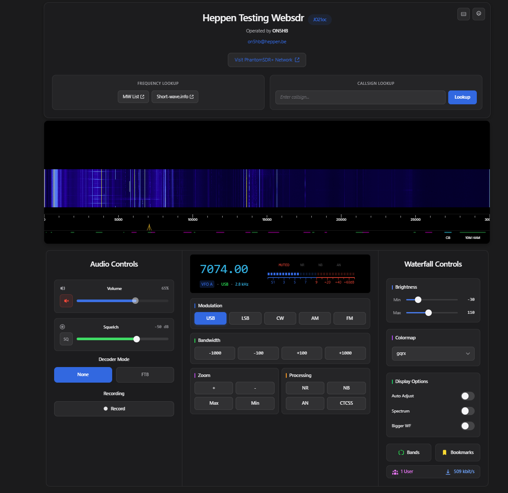

<!--
  NovaSDR README
  Polished, scannable, and easy to follow. Hero image + badges + quick start.
-->

<h1 align="center">NovaSDR</h1>
<p align="center"><i>formerly PhantomSDR‑Plus</i></p>

<p align="center">
  
</p>

<p align="center">
  <a href="https://en.cppreference.com/w/cpp/23"></a>
  <a href="https://mesonbuild.com/"></a>
  <a href="https://fftw.org/"></a>
  <a href="https://svelte.dev/"></a>
</p>

<p align="center">
  A modern, web‑enabled SDR server with a fast Svelte frontend. Stream spectrum, waterfall, and audio to any browser using efficient FFT and compression pipelines, with optional GPU acceleration.
</p>

<hr/>

## Highlights

- Fast C++ server with FFTW3f and multi‑level waterfall decimation
- Responsive Svelte + Vite + Tailwind UI (mobile friendly)
- Efficient compression: zstd waterfalls and FLAC audio (Opus/AV1 optional at build time)
- Optional accelerators: CUDA (cuFFT), OpenCL (clFFT), or MKL
- Device‑agnostic: read raw samples from stdin (rtl_sdr, hackrf_transfer, airspy_rx, rx_sdr, rx888_stream, …)
- Optional station listing on https://sdr-list.xyz

> Rename notice  
> This project was previously called “PhantomSDR‑Plus”. It has been renamed to “NovaSDR” to avoid confusion with the separate “PhantomSDR” project. Legacy identifiers (e.g., “PhantomSDR+ v2.0.0”) may still appear in logs or internal modules and will be harmonized over time.

---

## Supported hardware (via stdin piping)

- RTL‑SDR (rtl_sdr)
- HackRF One (hackrf_transfer)
- Airspy HF+ (airspy_rx)
- SDRplay RSP1A (rx_sdr with SoapySDR `driver=sdrplay`)
- RX888 MK2 (vendor tools, e.g., rx888_stream)

NovaSDR does not speak to hardware directly. You pipe raw samples to the server over stdin with the correct format.

---

## Quick start (Linux)

1) Install toolchain and libraries (Debian/Ubuntu)

```bash
sudo apt update && sudo apt install -y \
  build-essential meson ninja-build pkg-config git \
  libfftw3-dev libzstd-dev libflac++-dev zlib1g-dev \
  libboost-system-dev libboost-iostreams-dev libcurl4-openssl-dev
```

Optional accelerators:
- OpenCL runtime + headers (e.g., `ocl-icd-opencl-dev`) and your vendor GPU runtime
- CUDA toolkit for NVIDIA GPUs

2) Build backend

```bash
meson setup build
meson compile -C build
```

3) Build frontend

```bash
cd frontend
npm install
npm run build
cd ..
```

4) Configure NovaSDR  
Copy one of the curated examples to `config.toml` and adjust for your device:

- `config.example.rtlsdr.toml`
- `config.example.hackrf.toml`
- `config-airspyhf.toml`
- `config-rsp1a.toml`
- `config-rx888mk2.toml`

5) Run (examples below)  
Open the UI at: `http://localhost:9002`

---

## Run examples (correct formats included)

- RTL‑SDR (2.048 Msps, WBFM; format: `u8`)
```bash
rtl_sdr -g 48 -f 100900000 -s 2048000 - | ./build/spectrumserver --config config.toml
```

- HackRF (10 Msps, WBFM; format: `s8`)
```bash
hackrf_transfer -r - -f 100900000 -s 10000000 | ./build/spectrumserver --config config.toml
```

- Airspy HF+ (912 ksps, AM; format: `s16`)
```bash
airspy_rx -r - -f 648000 -s 912000 | ./build/spectrumserver --config config.toml
```

- SDRplay RSP1A (8 Msps, LSB; format: `s16`)
```bash
rx_sdr -d driver=sdrplay -f 7100000 -s 8000000 - | ./build/spectrumserver --config config.toml
```

- RX888 MK2 (real sampling 6 Msps; format: `s16`, `signal=real`)
```bash
rx888_stream -s 6000000 | ./build/spectrumserver --config config.toml
```

> Tip: Ultra‑high sample rates (e.g., 60 Msps) require powerful hardware, large FFT sizes, and likely GPU acceleration. Start lower and scale up.

---

## Configuration overview (matches server schema)

NovaSDR reads a single TOML file. Keys below are exactly what the server uses internally.

```toml
[server]
port = 9002                 # TCP port (default 9002)
host = "0.0.0.0"            # Bind address (default 0.0.0.0)
html_root = "frontend/dist/"# Static files (default "html/")
otherusers = 1              # Show other listeners (1/0)
threads = 1                 # Server worker threads

[websdr]
register_online = false     # Publish on https://sdr-list.xyz
name = "NovaSDR"
antenna = "ChangeThis"
grid_locator = "AB12cd"
hostname = ""               # Public domain if any
operator = "ChangeThis"
email = "example@test.com"
callsign_lookup_url = "https://www.qrz.com/db/"
chat_enabled = true

[limits]
audio = 100                 # Max concurrent connections
waterfall = 200
events = 200

[input]
sps = 2048000               # REQUIRED: input sample rate
frequency = 100900000       # REQUIRED: center freq (Hz)
signal = "iq"               # REQUIRED: "iq" or "real"
fft_size = 131072
fft_threads = 1
brightness_offset = 0
audio_sps = 12000
waterfall_size = 1024
waterfall_compression = "zstd"  # "zstd" (AV1 needs special build)
audio_compression = "flac"      # "flac" (Opus needs special build)
accelerator = "none"            # "none" | "opencl" | "cuda" | "mkl"
smeter_offset = 0

[input.driver]
name = "stdin"
format = "u8"               # u8 | s8 | u16 | s16 | cs16 | f32 | cf32 | f64

[input.defaults]
frequency = 100900000
modulation = "WBFM"         # AM | SAM | FM | WBFM | USB | LSB
```

If you see “Out of memory” at startup, reduce `input.fft_size`.

---

## Frontend development

```bash
cd frontend
npm install
npm run dev
```

Open the Vite URL (e.g., http://localhost:5173). For production, use `npm run build` and point `server.html_root` to `frontend/dist/`.

---

## Contributing

Issues and PRs are welcome. Please keep config keys consistent with the server’s schema implemented in `src/spectrumserver.cpp` and follow the project formatting via `.clang-format`.

---

## License

See `LICENSE`.
